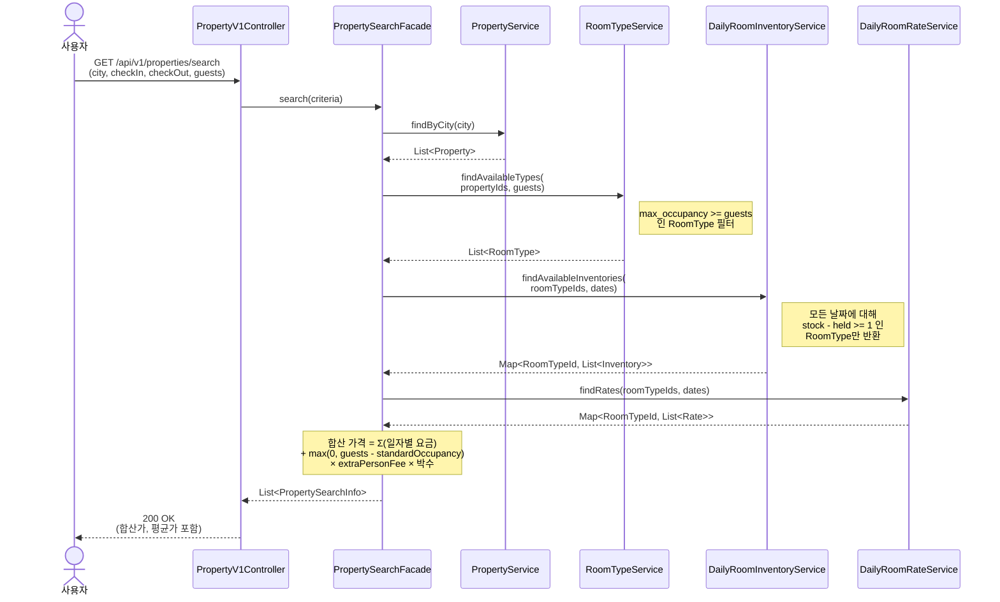
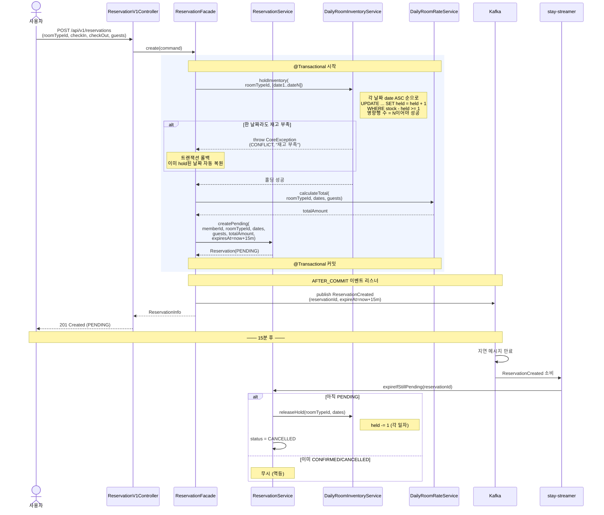
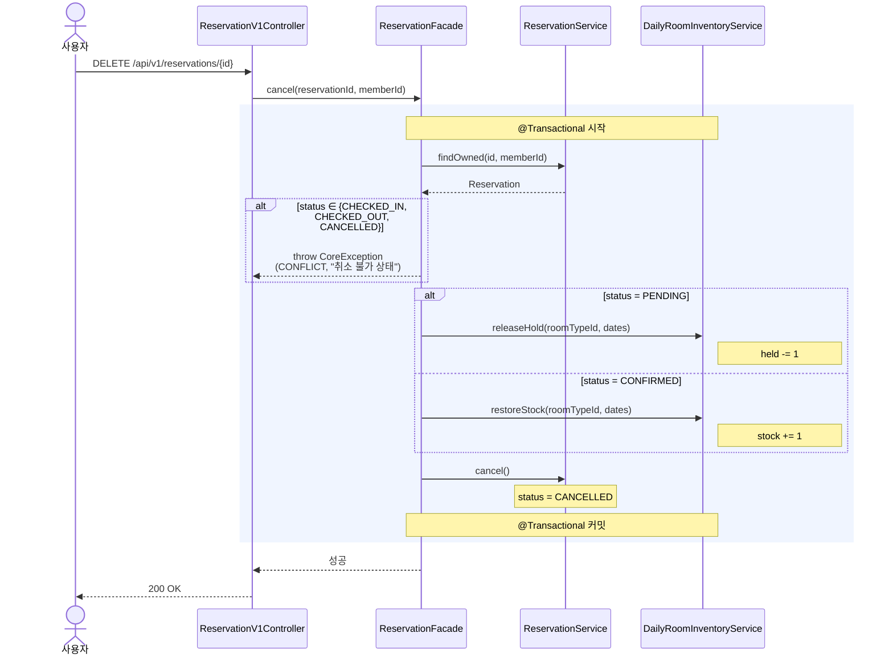
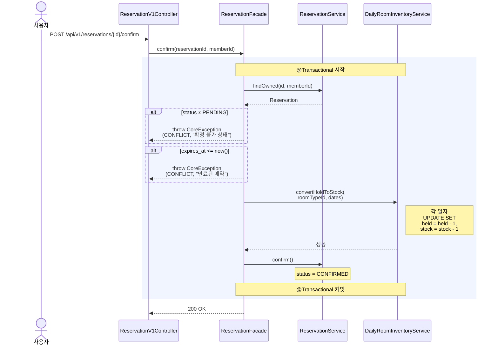
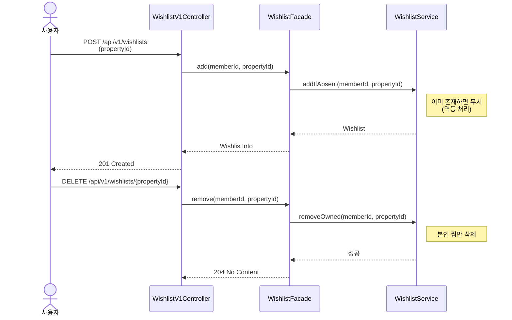

# 02. 시퀀스 다이어그램

본 문서는 핵심 유스케이스의 컴포넌트 간 상호작용과 트랜잭션 경계를 시각화한다. 다이어그램은 모두 Mermaid로 작성되어 GitHub 등에서 즉시 렌더링된다.

---

## 1. 숙소 검색

### 왜 이 다이어그램이 필요한가

검색은 단순 조회처럼 보이지만 `RoomType × N일 × (재고 + 요금)`을 조합해 **합산 가격**과 **1박 평균 가격**을 계산해야 한다. 책임이 어느 레이어에 있는지 명확히 잡지 않으면 N+1 쿼리 또는 거대 SQL로 흐른다. 이 시퀀스는 Facade가 도메인 서비스를 조합해 점진 필터링하는 흐름을 검증한다.

### 읽는 포인트

- **점진 필터링**: Property → RoomType → Inventory → Rate 순서로 후보를 좁힌다. 각 단계에서 다음 단계로 넘길 ID 집합만 추출
- **계산 책임은 Facade**: 도메인 서비스는 데이터만 모아 주고, "합산 가격"이라는 표현 계산은 Facade에서 수행
- **분리된 테이블의 조립**: Inventory와 Rate는 다른 테이블이지만 같은 키 `(room_type_id, date)`를 공유하므로 Facade에서 Map 기반 조립

---

## 2. 예약 생성 (홀딩 포함)

### 왜 이 다이어그램이 필요한가

이번 설계의 **핵심**이다. 다음 세 가지를 검증한다.
1. 체크인~체크아웃 사이 **모든 일자별 재고를 차감**하는 흐름
2. 한 날짜라도 재고가 0이면 전체 예약이 실패하는 원자성
3. 트랜잭션 경계 — 재고 차감·예약 생성·Kafka 발행이 어디서 묶이고 어디서 분리되는가

### 읽는 포인트

- **재고 홀딩과 예약 생성은 하나의 트랜잭션** — 부분 차감 상태가 절대 남지 않음
- **롤백 시 자동 복원** — N일 차감 중 한 날짜라도 실패하면 트랜잭션 롤백으로 이미 hold된 날짜도 원복됨. 명시적 보상 로직 불필요
- **Kafka 발행은 트랜잭션 커밋 후** — 커밋 전에 발행하면, 롤백 시 유령 메시지가 남는다. `@TransactionalEventListener(AFTER_COMMIT)` 또는 트랜잭셔널 아웃박스 사용
- **만료 처리는 멱등** — 사용자가 그 사이 확정/취소했을 수 있으므로, 만료 핸들러는 현재 상태가 PENDING일 때만 동작

---

## 3. 예약 취소

### 왜 이 다이어그램이 필요한가

취소는 단순해 보이지만 (1) 현재 상태에 따라 복원 대상이 다르고 (`held` vs `stock`), (2) CHECKED_IN 이후는 정책상 불가하다. 이 분기 책임이 어디에 있는지와, 상태 가드·재고 복원이 하나의 트랜잭션으로 묶이는지를 확인한다.

### 읽는 포인트

- **상태에 따른 복원 분기는 Facade의 책임** — PENDING은 `held`, CONFIRMED는 `stock`. 이 분기는 도메인 서비스가 아닌 조합 계층에서
- **소유자 검증** — `findOwned(id, memberId)`로 본인 예약만 취소 가능. 인가 로직이 도메인 조회 단계에 포함
- **상태 가드와 재고 복원이 같은 트랜잭션** — 일관성 즉시 보장

---

## 4. 예약 확정 (PENDING → CONFIRMED)

### 왜 이 다이어그램이 필요한가

MVP에서는 결제가 없으므로 별도 확정 API가 PENDING → CONFIRMED 전이를 트리거한다. 이 과정에서 `held → stock`으로 재고가 이전되는 흐름과, 만료된 PENDING은 확정 불가 정책을 검증한다.

### 읽는 포인트

- **만료 시각 검증이 도메인 가드의 핵심** — Kafka 메시지가 지연될 수 있으므로 확정 API에서도 `expires_at`을 반드시 체크
- **held → stock 이전은 한 SQL** — 두 필드를 동시에 변경해 중간 상태가 보이지 않게
- **결제 연동 시 변경 지점** — 다음 스프린트에서 결제 콜백이 이 흐름을 대체

---

## 5. 찜하기 / 찜 해제

### 왜 이 다이어그램이 필요한가

찜은 도메인적으로 단순하지만 (1) 멱등성, (2) 본인 자원 검증 두 가지를 검증한다.

### 읽는 포인트

- **찜하기 멱등성** — 이미 찜한 상태에서 재요청해도 에러 없이 통과. 중복 등록은 DB 유니크 제약으로 1차 방지
- **본인 자원 검증** — 찜 해제 시 `memberId + propertyId` 조합으로 조회해 인가
