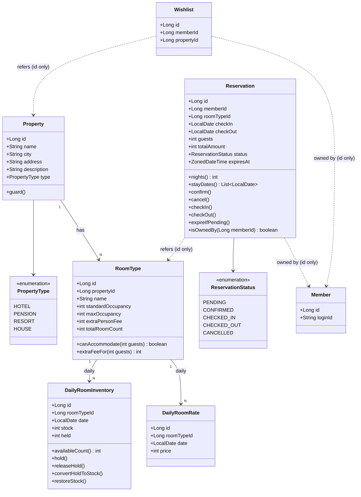

# 03. 클래스 다이어그램

본 문서는 도메인 객체의 책임과 의존 방향을 시각화한다. 핵심은 다음 두 가지 검증이다.

1. **Reservation은 DailyRoomInventory를 직접 알지 않는다.** 두 도메인을 조합하는 책임은 Application(Facade) 레이어가 진다.
2. **상태 전이는 enum이 아닌 엔티티 메서드로 보호한다.** ReservationStatus는 단순 식별자이고, 가드는 `Reservation.confirm()`, `cancel()` 등에서 수행한다.

---

## 1. 전체 클래스 다이어그램



> **점선 화살표(`..>`)** = ID 참조 (FK), **실선 화살표(`-->`)** = 객체 컴포지션

---

## 2. 도메인별 책임 정의

### Property

숙소의 메타 정보를 보유한다. 검색의 1차 필터(도시) 기준이 되며, 찜의 대상이다.

| 속성 | 의미 |
|------|------|
| `name`, `city`, `address`, `description` | 표시·검색용 정보 |
| `type` | HOTEL / PENSION / RESORT / HOUSE 등. 운영·통계용 분류 |

### RoomType

Property에 속하는 객실 카테고리. 인원 정책과 추가 요금을 보유한다.

| 메서드 | 책임 |
|--------|------|
| `canAccommodate(guests)` | `guests <= maxOccupancy` 검증 |
| `extraFeeFor(guests)` | `max(0, guests - standardOccupancy) * extraPersonFee` 반환 |

- `totalRoomCount`는 일자별 재고 행을 생성할 때 `stock` 초기값의 기준이다 (운영 데이터)

### DailyRoomInventory

`(room_type_id, date)` 단위 재고. **이 프로젝트의 동시성 핵심 엔티티**다.

| 메서드 | 책임 |
|--------|------|
| `availableCount()` | `stock - held` |
| `hold()` | `held += 1`. 가드: `available >= 1` |
| `releaseHold()` | `held -= 1`. PENDING 취소·만료 시 |
| `convertHoldToStock()` | `held -= 1, stock -= 1`. PENDING → CONFIRMED |
| `restoreStock()` | `stock += 1`. CONFIRMED 취소 시 |

> 실제 동시성은 단일 SQL `UPDATE ... WHERE stock - held >= 1`로 처리하므로, 메서드는 JPA 영속 단위에서의 의미적 표현. 일괄 차감은 도메인 서비스가 SQL 레벨에서 수행한다.

### DailyRoomRate

`(room_type_id, date)` 단위 요금. 재고와 변경 주기가 다르므로 분리.

- 단순 값 보유 객체. 비즈니스 로직은 거의 없음
- 합산 가격 계산은 Facade가 일자 리스트를 받아 처리

### Reservation

예약 본체. 상태 머신의 주체이며, 자기 상태 전이 가드를 직접 책임진다.

| 메서드 | 가드 | 효과 |
|--------|------|------|
| `confirm()` | `status == PENDING && expiresAt > now()` | status → CONFIRMED |
| `cancel()` | `status ∈ {PENDING, CONFIRMED}` | status → CANCELLED |
| `checkIn()` | `status == CONFIRMED && checkIn <= today` | status → CHECKED_IN |
| `checkOut()` | `status == CHECKED_IN` | status → CHECKED_OUT |
| `expireIfPending()` | `status == PENDING` | status → CANCELLED (멱등, false 반환 가능) |
| `isOwnedBy(memberId)` | - | 소유자 검증 |
| `stayDates()` | - | checkIn~checkOut(exclusive) 일자 리스트 |

> Reservation은 **재고를 직접 차감하지 않는다.** 재고 차감은 ReservationFacade가 InventoryService를 호출해 처리한다. 이렇게 분리하면 (1) Reservation 단위 테스트가 가벼워지고, (2) 재고 동시성 제어가 한 곳(InventoryService)에 모인다.

### Wishlist

회원의 Property 찜 기록.

- 도메인 행위는 거의 없는 연결 엔티티
- `(member_id, property_id)` 유니크 제약으로 중복 방지

### Member

회원 도메인 (1주차 완료). 본 설계에서는 ID 참조만 사용한다.

---

## 3. 레이어별 클래스 매핑

프로젝트의 패키지 규약(`interfaces → application → domain → infrastructure`)에 따른 매핑.

### Property / RoomType 검색

```
interfaces/api/property/
  ├── PropertyV1Controller
  ├── PropertyV1ApiSpec
  └── PropertyV1Dto (SearchRequest, SearchResponse)

application/property/
  ├── PropertySearchFacade
  └── PropertySearchInfo

domain/property/
  ├── Property
  ├── PropertyType (enum)
  ├── PropertyService
  └── PropertyRepository (interface)

domain/roomtype/
  ├── RoomType
  ├── RoomTypeService
  └── RoomTypeRepository (interface)

infrastructure/property/
  ├── PropertyRepositoryImpl
  └── PropertyJpaRepository

infrastructure/roomtype/
  ├── RoomTypeRepositoryImpl
  └── RoomTypeJpaRepository
```

### Inventory / Rate

```
domain/inventory/
  ├── DailyRoomInventory
  ├── DailyRoomInventoryService
  └── DailyRoomInventoryRepository

domain/rate/
  ├── DailyRoomRate
  ├── DailyRoomRateService
  └── DailyRoomRateRepository

infrastructure/inventory/
  ├── DailyRoomInventoryRepositoryImpl
  └── DailyRoomInventoryJpaRepository (네이티브 쿼리로 원자적 UPDATE)

infrastructure/rate/
  ├── DailyRoomRateRepositoryImpl
  └── DailyRoomRateJpaRepository
```

### Reservation

```
interfaces/api/reservation/
  ├── ReservationV1Controller
  ├── ReservationV1ApiSpec
  └── ReservationV1Dto

application/reservation/
  ├── ReservationFacade
  └── ReservationInfo

domain/reservation/
  ├── Reservation
  ├── ReservationStatus (enum)
  ├── ReservationService
  └── ReservationRepository

infrastructure/reservation/
  ├── ReservationRepositoryImpl
  └── ReservationJpaRepository
```

### Wishlist

```
interfaces/api/wishlist/
  ├── WishlistV1Controller
  ├── WishlistV1ApiSpec
  └── WishlistV1Dto

application/wishlist/
  ├── WishlistFacade
  └── WishlistInfo

domain/wishlist/
  ├── Wishlist
  ├── WishlistService
  └── WishlistRepository

infrastructure/wishlist/
  ├── WishlistRepositoryImpl
  └── WishlistJpaRepository
```

---

## 4. 의존 방향 검증

```
interfaces ──▶ application ──▶ domain ◀── infrastructure
                                  ▲
                                  │ implements
                                  │
                          infrastructure(*RepositoryImpl)
```

- 도메인은 어느 레이어에도 의존하지 않음 (Spring Data에도 직접 의존 안 함)
- 도메인이 정의한 Repository 인터페이스를 infrastructure에서 구현
- application(Facade)은 여러 도메인 서비스를 조합하지만, 도메인 간 상호 의존은 만들지 않음

### 도메인 간 의존 규칙

| 관계 | 방향 | 형태 |
|------|------|------|
| Property → RoomType | 단방향 | RoomType이 propertyId 보유 |
| RoomType → Inventory/Rate | 단방향 | Inventory/Rate가 roomTypeId 보유 |
| Reservation → RoomType | 의존 없음 (ID 참조만) | Reservation은 roomTypeId만 보유 |
| Reservation ↔ Inventory | **직접 의존 금지** | Facade에서 조합 |

---

## 5. 응집도 / 결합도 포인트

### ✅ 응집도가 높은 부분

- **DailyRoomInventory**의 모든 메서드(`hold`, `releaseHold`, `convertHoldToStock`, `restoreStock`)는 `stock`/`held` 조작 한 가지에 집중
- **Reservation**의 모든 메서드는 자기 상태 전이에 집중

### ⚠ 결합도가 높아질 수 있는 부분

- **ReservationFacade**가 4개 도메인 서비스(Reservation, Inventory, Rate, RoomType)를 동시에 다룬다. Facade가 비대해지면 유스케이스 단위로 분리 (예: `ReservationCreationFacade`, `ReservationCancellationFacade`)
- **PropertySearchFacade**는 검색 흐름이 길어질수록 책임이 늘어난다. ES 도입 시 검색 자체를 별도 컴포넌트로 분리할 여지를 둠
