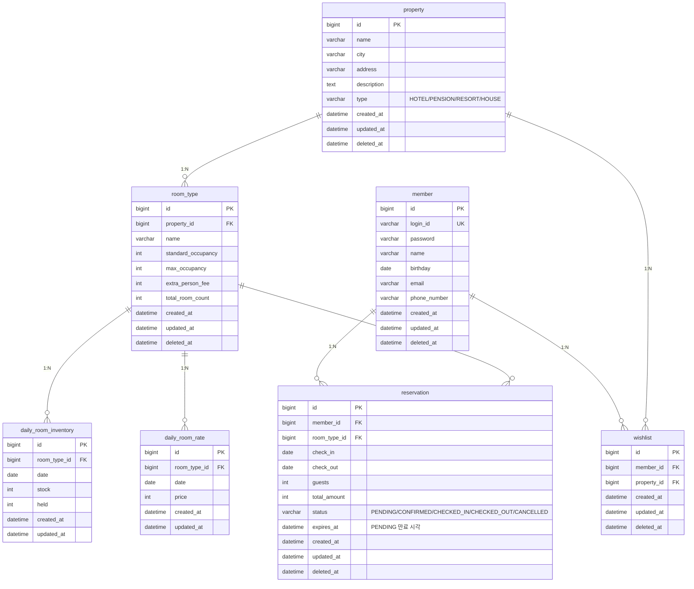

# 04. ERD

본 문서는 영속성 구조와 데이터 정합성 전략을 정리한다. 핵심은 `(room_type_id, date)` 복합 유니크와 다일자 차감의 동시성 제어다.

---

## 1. 전체 ERD



> 모든 테이블은 `BaseEntity`를 상속하므로 `created_at`, `updated_at`, `deleted_at`(soft delete)을 가진다. 단, `daily_room_inventory`와 `daily_room_rate`는 운영 데이터 성격이라 soft delete를 적용하지 않는다.

---

## 2. 테이블별 상세

### 2.1 `property`

| 컬럼 | 타입 | 제약 | 설명 |
|------|------|------|------|
| `id` | BIGINT | PK, AUTO_INCREMENT | |
| `name` | VARCHAR(200) | NOT NULL | 숙소명 |
| `city` | VARCHAR(50) | NOT NULL | 도시명 |
| `address` | VARCHAR(500) | NOT NULL | 상세 주소 |
| `description` | TEXT | | 숙소 소개 |
| `type` | VARCHAR(20) | NOT NULL | HOTEL/PENSION/RESORT/HOUSE |
| `created_at`, `updated_at`, `deleted_at` | DATETIME(6) | | BaseEntity |

**인덱스**
- `idx_property_city` (`city`) — 검색 1차 필터

---

### 2.2 `room_type`

| 컬럼 | 타입 | 제약 | 설명 |
|------|------|------|------|
| `id` | BIGINT | PK | |
| `property_id` | BIGINT | NOT NULL, FK → property.id | |
| `name` | VARCHAR(100) | NOT NULL | 객실 타입명 |
| `standard_occupancy` | INT | NOT NULL | 기준 인원 |
| `max_occupancy` | INT | NOT NULL | 최대 수용 인원 |
| `extra_person_fee` | INT | NOT NULL DEFAULT 0 | 추가 인원당 요금 |
| `total_room_count` | INT | NOT NULL | 보유 객실 총수 (재고 초기값 기준) |

**인덱스**
- `idx_room_type_property` (`property_id`)
- `idx_room_type_max_occupancy` (`max_occupancy`) — 검색 필터

**체크 제약**
- `standard_occupancy >= 1`
- `max_occupancy >= standard_occupancy`
- `total_room_count >= 1`

---

### 2.3 `daily_room_inventory`

**이번 설계의 동시성 핵심 테이블.**

| 컬럼 | 타입 | 제약 | 설명 |
|------|------|------|------|
| `id` | BIGINT | PK | |
| `room_type_id` | BIGINT | NOT NULL, FK | |
| `date` | DATE | NOT NULL | 해당 일자 |
| `stock` | INT | NOT NULL | 총 가용 재고 (CONFIRMED 차감 후) |
| `held` | INT | NOT NULL DEFAULT 0 | PENDING 임시 점유 수량 |

**인덱스**
- `uk_inventory_room_date` (`room_type_id`, `date`) **UNIQUE** — 중복 행 방지·동시성 제어 기준
- `idx_inventory_date` (`date`) — 일자 단위 운영 조회

**체크 제약**
- `stock >= 0`
- `held >= 0`
- `held <= stock` (애플리케이션 UPDATE 시 보장)

**핵심 SQL**
```sql
-- 홀딩 (예약 생성)
UPDATE daily_room_inventory
   SET held = held + 1
 WHERE room_type_id = ? AND date = ?
   AND stock - held >= 1;
-- affectedRows == 1 이어야 성공, 아니면 재고 부족

-- 홀딩 해제 (PENDING 취소/만료)
UPDATE daily_room_inventory
   SET held = held - 1
 WHERE room_type_id = ? AND date = ?
   AND held >= 1;

-- 확정 (PENDING → CONFIRMED)
UPDATE daily_room_inventory
   SET held = held - 1,
       stock = stock - 1
 WHERE room_type_id = ? AND date = ?
   AND held >= 1 AND stock >= 1;

-- 복원 (CONFIRMED 취소)
UPDATE daily_room_inventory
   SET stock = stock + 1
 WHERE room_type_id = ? AND date = ?;
```

---

### 2.4 `daily_room_rate`

| 컬럼 | 타입 | 제약 | 설명 |
|------|------|------|------|
| `id` | BIGINT | PK | |
| `room_type_id` | BIGINT | NOT NULL, FK | |
| `date` | DATE | NOT NULL | 해당 일자 |
| `price` | INT | NOT NULL | 1박 기본 요금 |

**인덱스**
- `uk_rate_room_date` (`room_type_id`, `date`) **UNIQUE**
- `idx_rate_date` (`date`)

**체크 제약**
- `price >= 0`

---

### 2.5 `reservation`

| 컬럼 | 타입 | 제약 | 설명 |
|------|------|------|------|
| `id` | BIGINT | PK | |
| `member_id` | BIGINT | NOT NULL, FK → member.id | |
| `room_type_id` | BIGINT | NOT NULL, FK | |
| `check_in` | DATE | NOT NULL | |
| `check_out` | DATE | NOT NULL | exclusive (체크아웃 당일은 점유 안 함) |
| `guests` | INT | NOT NULL | |
| `total_amount` | INT | NOT NULL | **예약 생성 시점 가격 고정** |
| `status` | VARCHAR(20) | NOT NULL | PENDING/CONFIRMED/CHECKED_IN/CHECKED_OUT/CANCELLED |
| `expires_at` | DATETIME(6) | NULL | PENDING 만료 시각 (CONFIRMED 이후 NULL 무관) |

**인덱스**
- `idx_reservation_member_status` (`member_id`, `status`) — 내 예약 조회
- `idx_reservation_room_dates` (`room_type_id`, `check_in`, `check_out`) — 운영 조회
- `idx_reservation_pending_expires` (`status`, `expires_at`) — 만료 안전망 배치용

**체크 제약**
- `check_in < check_out`
- `guests >= 1`
- `total_amount >= 0`

---

### 2.6 `wishlist`

| 컬럼 | 타입 | 제약 | 설명 |
|------|------|------|------|
| `id` | BIGINT | PK | |
| `member_id` | BIGINT | NOT NULL, FK → member.id | |
| `property_id` | BIGINT | NOT NULL, FK → property.id | |

**인덱스**
- `uk_wishlist_member_property` (`member_id`, `property_id`) **UNIQUE** — 중복 찜 방지
- `idx_wishlist_member` (`member_id`) — 내 찜 목록 조회

---

## 3. 인덱스 설계 근거

| 인덱스 | 사용 쿼리 | 카디널리티 |
|--------|----------|----------|
| `property(city)` | 검색 1차 필터 | 도시 수 = 중 |
| `room_type(property_id)` | 숙소 상세 조회 | 보통 |
| `room_type(max_occupancy)` | 검색 인원 필터 | 낮음 (1~10 정도) |
| `daily_room_inventory(room_type_id, date)` UK | 다일자 차감, 검색 시 가용성 체크 | 매우 높음 |
| `daily_room_rate(room_type_id, date)` UK | 다일자 요금 조회 | 매우 높음 |
| `reservation(member_id, status)` | 내 예약 목록 (PENDING/CONFIRMED 우선) | 보통 |
| `reservation(status, expires_at)` | 만료 안전망 배치 (`WHERE status='PENDING' AND expires_at < now()`) | 낮음 |
| `wishlist(member_id, property_id)` UK | 멱등 찜하기, 중복 방지 | 보통 |

---

## 4. 동시성 / 정합성 전략

### 4.1 다일자 재고 차감 — 원자적 UPDATE

각 일자별로 다음 SQL을 실행하고 `affectedRows == 1`을 검증한다.
```sql
UPDATE daily_room_inventory
   SET held = held + 1
 WHERE room_type_id = ? AND date = ?
   AND stock - held >= 1;
```

- 락 없이 동시성 제어 가능 (행 수준 atomic UPDATE)
- 한 날짜라도 affectedRows == 0이면 트랜잭션 롤백 → 앞서 hold된 행도 자동 복원
- **데드락 방지**: 다일자 처리 시 항상 `date ASC` 순서로 UPDATE

### 4.2 트랜잭션 경계

| 작업 | 트랜잭션 단위 |
|------|--------------|
| 예약 생성 | inventory 다일자 UPDATE + reservation INSERT |
| Kafka 발행 | **트랜잭션 커밋 후** (TransactionalEventListener AFTER_COMMIT) |
| 예약 취소 | inventory 다일자 UPDATE + reservation UPDATE |
| PENDING 만료 | reservation 상태 확인 + inventory 복원 + reservation UPDATE (멱등) |

### 4.3 가격 일관성

- `reservation.total_amount`는 예약 생성 시점 가격을 **고정 저장**
- 관리자가 이후 `daily_room_rate.price`를 변경해도 기존 예약은 영향 없음

### 4.4 만료 안전망

- Kafka 메시지 유실 가능성 대비
- stay-batch가 주기적으로 (예: 5분마다) 실행:
```sql
SELECT id FROM reservation
 WHERE status = 'PENDING'
   AND expires_at < NOW();
```
- 결과의 각 예약에 대해 `expireIfStillPending(id)` 호출 (멱등)

---

## 5. 데이터 라이프사이클

### 5.1 일자별 재고/요금 사전 적재

- 운영 정책: 향후 N일치 (예: 365일)를 미리 적재
- stay-batch에서 일배치로 `room_type` × 미래 N일 만큼 `daily_room_inventory`(stock=`total_room_count`, held=0)와 `daily_room_rate`(기본 요금) 행 생성
- 신규 RoomType 등록 시점에도 적재 잡 트리거

### 5.2 과거 데이터

- `daily_room_inventory`, `daily_room_rate`의 과거 일자 행은 보존 (통계·정산 활용)
- 1년 이상 경과한 행은 별도 아카이브 정책 검토 (이번 스코프 외)

### 5.3 Reservation 소프트 삭제

- BaseEntity의 `deletedAt`로 소프트 삭제 지원
- CANCELLED와 deleted는 별개. 취소는 비즈니스 상태, 삭제는 데이터 가시성 제어 (GDPR 등)

---

## 6. 잠재 리스크 / 트레이드오프

### 🚨 트랜잭션 비대화

- 30박 예약이면 한 트랜잭션에서 30개 inventory 행 UPDATE → 락 보유 시간 증가
- **완화책**: 최대 숙박 일수 정책 (예: 30박) 또는 단일 SQL multi-row UPDATE

### 🚨 Kafka 메시지 유실

- 트랜잭션 커밋 직후 서버 다운 시 메시지 발행 실패 가능
- **완화책**: (1) 트랜잭셔널 아웃박스 패턴, (2) `expires_at` 기반 배치 안전망 병행

### 🚨 인덱스 부담

- `daily_room_inventory`, `daily_room_rate`는 RoomType 수 × 일수만큼 행이 누적
- 1년 = 365일, RoomType 1만 개 → 약 365만 행 (충분히 감당 가능한 규모)
- 더 커지면 파티셔닝 (date 기준) 고려

### 🚨 검색 성능

- 현재는 RDB 조인으로 검색. 트래픽 증가 시 N+1 또는 거대 조인 위험
- **완화책**: 검색 인터페이스를 추상화해 두고, 부하 증가 시 ES로 전환
